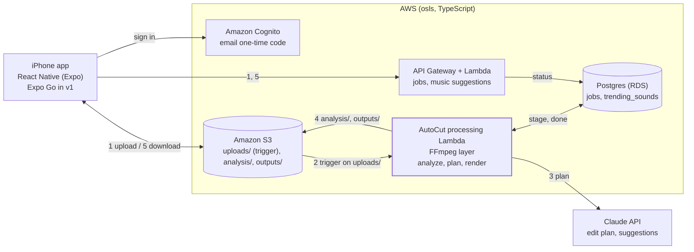

# Architecture (v1)

Natalie Bot v1 is AutoCut: attach a video, say what you want, and get back a 15–30 second 9:16 reel that you can refine in a chat and export. No music is put into the video. At export the app suggests sounds to add in Instagram. The phone never streams video through the API: it uploads to and downloads from S3 with presigned URLs, and only the processing Lambda touches the video.

Full design: [Natalie Bot technical design, AutoCut v1 tab](https://claude.ai/code/artifact/7159431e-2770-42c8-995f-9434b38c3061).

## The flow

The numbers on the arrows match these steps.

1. The app creates a job with a prompt (`POST /v1/jobs`) and uploads the video straight to `uploads/` in S3 with the presigned POST it gets back.
2. The upload triggers the processing Lambda. **Analyze:** FFmpeg samples a frame per second into contact sheets and measures loudness and scene cuts. The results go to `analysis/`.
3. **Plan:** the Lambda sends the contact sheets, the signals and the prompt to Claude. It gets back an edit plan (which seconds to keep, where to crop), then validates it.
4. **Render:** FFmpeg cuts and crops the reel to 1080 × 1920 and writes it to `outputs/`. The job's stage is kept up to date in Postgres throughout.
5. The app polls `GET /v1/jobs/{jobId}` and plays the reel through a presigned URL. A reply in the chat creates a refine job that starts at step 3, reusing the saved analysis.

## Limits that shape the design

- Uploads, analysis and outputs live under separate prefixes, and the S3 event notification is filtered to `uploads/`. Without that filter, each file the Lambda writes would trigger it again, in an endless loop.
- Videos are capped at 5 minutes and 2 GB, so analysis, planning and rendering fit in one Lambda run (15-minute limit, 10 GB of local disk). Longer videos would move to MediaConvert or Fargate.
- **The processing Lambda needs both RDS and the internet.** It runs in the VPC to reach RDS, which cuts it off from the internet by default. But the Plan step must call the Claude API. An S3 gateway endpoint covers S3 and nothing else. The recommendation is a NAT gateway: it's the simplest fix, but it has a fixed monthly cost. The alternative is to keep the processing Lambda outside the VPC and update job rows through a small in-VPC Lambda. This is undecided and is tracked in the design doc's open questions.
- Many Lambdas running at once can use up the RDS connection limit. Lambda reserved concurrency keeps the number of parallel jobs small, and RDS Proxy is the next step if that isn't enough.
- The original audio is kept. Music is suggested at export and added in Instagram, which keeps the app clear of music licensing.
- Posting directly to Instagram is out of scope for v1. Users save to Photos and open Instagram.
- The App Store (Apple enrollment, TestFlight, Sign in with Apple) comes after v1.
