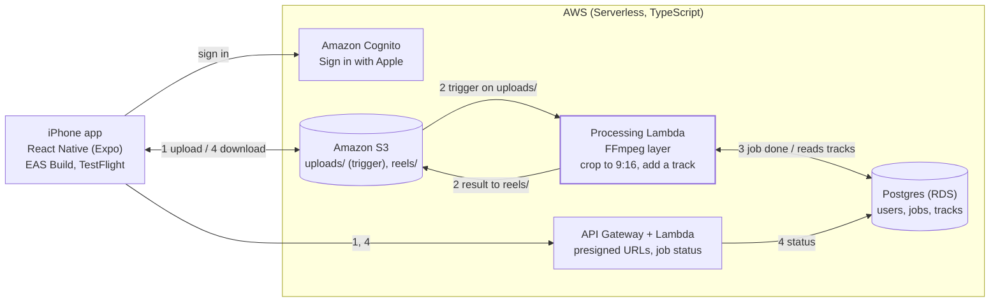

# Architecture (v1)

Natalie Bot v1 does one thing: upload a video, get it back as a 9:16 reel with music. The phone never streams video through the API. It uploads to and downloads from S3 with presigned URLs, and only the processing Lambda touches the video.

## The flow

The numbers on the arrows match these steps.

1. The app asks the API (API Gateway + Lambda) for a presigned S3 URL and uploads the video directly to the `uploads/` prefix in S3.
2. The upload triggers the processing Lambda, which has an FFmpeg layer. It crops the video to 9:16 (1080 x 1920), picks a track from the library, replaces the audio with it, and writes the result to the `reels/` prefix. The S3 trigger is filtered to `uploads/` only, so a finished reel never triggers another run.
3. The Lambda marks the job done in Postgres (RDS), which has tables for users, jobs and tracks.
4. The app polls the API for job status, then downloads the finished reel through a presigned URL.

Auth is Cognito with Sign in with Apple. Builds ship through EAS Build and Submit and are tested in TestFlight.

## Limits that shape the design

- Uploads and reels live under separate prefixes, and the S3 event notification is filtered to `uploads/`. Without that filter, each reel the Lambda writes would trigger it again, in an endless loop.
- The processing Lambda runs in the VPC to reach RDS, which cuts it off from the internet by default. An S3 gateway endpoint gives it S3 access without a NAT gateway.
- Many Lambdas running at once can use up the RDS connection limit. Lambda reserved concurrency keeps the number of parallel jobs small, and RDS Proxy is the next step if that isn't enough.
- Uploads are capped at 90 seconds so rendering stays well inside Lambda's 15-minute limit. If renders outgrow it, rendering moves to Fargate.
- v1 replaces the original audio instead of mixing music under it.
- Posting directly to Instagram is out of scope for v1. Users share through the iOS share sheet.
